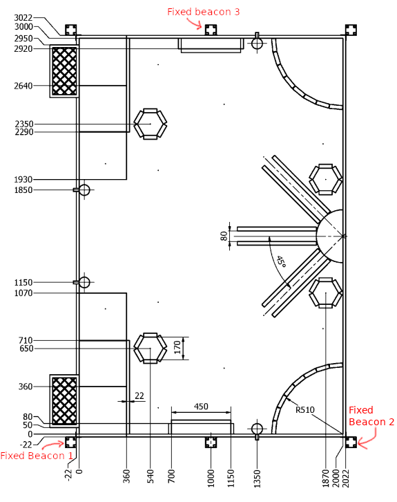
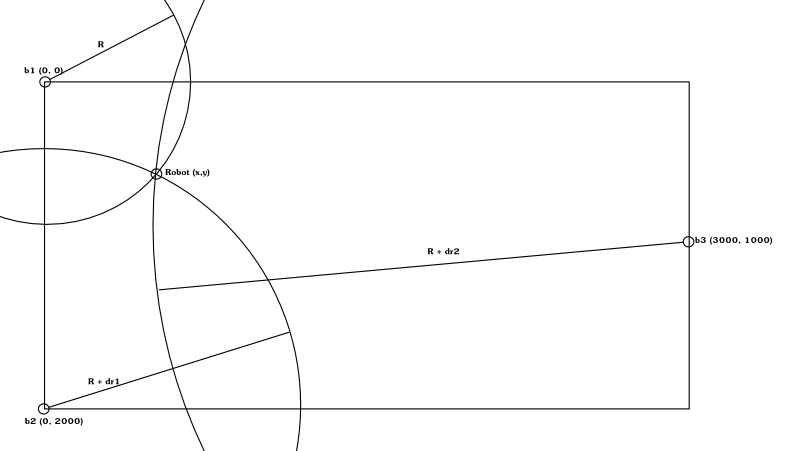

# Ultrasonic indoor positioning system
This project contains electronic card design and software to build an indoor 2D positioning system based on ultrasonic 
emitters and receivers with Time Difference Of Arrival (TDOA) algorithm to determine position.

## Context
This project has been made during French Robotic Cup which takes place in european Eurobot contest. During this contest,
2 teams are playing one against the other, with one or two bots, to achieve some objectives, on a game table of 2 per 3
meters. Bots must not enter in collision with other team bots, purpose of this project is to determine quite precisely
position of 2 opponent bots.

Contest rules allow to place 3 fixed beacons on dedicated table places which will be called receivers, and a 
80mm\*80mm\*80mm beacon on each opponent bot which will be called emitters.

See [contest rules](doc/E2017_Rules_EN.pdf) for more details.

### Extra considerations
* Due to intensive usage of 40kHz ultrasonic modules by other teams, we avoided use of 40kHz frequency.
* To avoid possible interference with other teams, a sort of "modulation" have been implemented.
* Using low frequency ultrasonic transceivers and receivers allow to emit/receive on a wide angle.

## Principle
An emitter is placed on opponent bot, emitter will emit every 75ms a signal over 360°. One of the three fixed receivers
will receive the signal first at time reference T. Due to slow speed of sound, the 2nd receives a bit later at T + dt1,
and the 3rd later next at T + dt2. Knowing speed of sound, dt1 and dt2 can be converted to distance dr1 and dr2. With
only dr1 and dr2 and a Time Difference Of Arrival (TDOA) algorithm, we can compute position of emitter on a plan.

R is unknown, only dr1 and dr2 are determined by the system.

## System accuracy
TODO

## Architecture
Project is made of following parts.

### 2 emitters
One working with 25kHz frequency, one with 32.8kHz frequency. Emitters are made of:
* 1 9V battery
* 1 ATtiny45 microcontroller for pulse generation
* 4 ultrasonic transceivers
* some electronic for power supply, H bridge to run transceivers, ...

### 3 receivers
Each receiver beacon is made with one cards to receive 25kHz another one to receive 32.8kHz signals with 2 or 3
ultrasonic receivers.

Each ultrasonic receiver is made of
* 1 ultrasonic receiver
* 1 4 channels TLO74CN Operational Amplifier
* Some resistors, capacitors and schottky diodes for signal amplification and filtering
* 1 ATtiny45 for reading analog input and building a simple HIGH signal when ultrasonic signal is received

It contains also a power card which ensure different power conversions and aggregate demodulated signals from receivers,
made of:
* 2 9V battery
* 1 12V NCP1117DT12RKG convertor
* 1 5V R-78E5.0-0.5 convertor
* 1 3.3 LP2950ACDT-3.3RG convertor (for receiver beacon 1 only)
* Few connectors

#### Receiver 1
Contains 1 power card, 1 card with 2 receiver channels of 25kHz and 1 card with 2 receiver channels of 32.8kHz.

It also contains 1 RF card, which receive all numerical signals produced by receivers channels, compute TDOA algorithm
and send position by serial to RF module. It is made of:
* 1 Teensy 3.2 micro controller
* 1 RFBee (or 1 ESP8266, extra adaptor card needed)
* Few 3.3V zener diodes and schottky diodes
* Few connectors

#### Receiver 2
Contains 1 power card, 1 card with 2 receiver channels of 25kHz and 1 card with 2 receiver channels of 32.8kHz.

#### Receiver 3
Contains 1 power card, 1 card with 3 receiver channels of 25kHz and 1 card with 3 receiver channels of 32.8kHz.

## Folder structure of project
### Simulation
[simu](simu) folder contains some simulations for testing different algorithms. See [simu/README.md](simu/README.md)
for more information.

### Electronics
[elec](elec) folder contains electronic designs of one 25kHz emitter, one 32.8kHz emitter, 3 receivers of 25kHz and
32.8kHz, and other power cards. See [elec/README.md](elec/README.md) for more information.

### Code
[code](code) folder contains code of all microcontroller used in this project. See [code/README.md](code/README.md) for
more information.