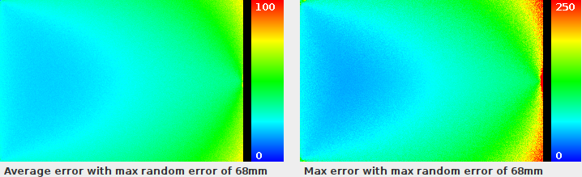
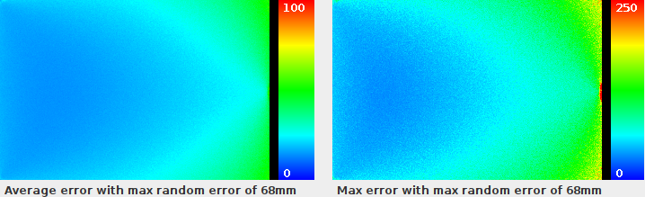
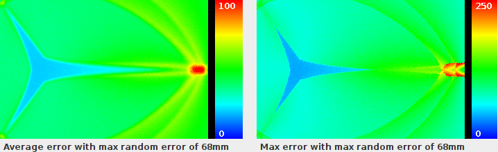
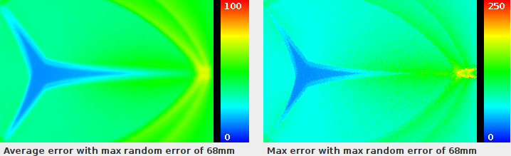
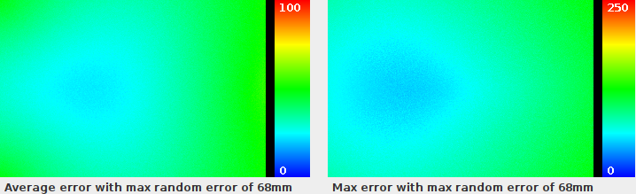
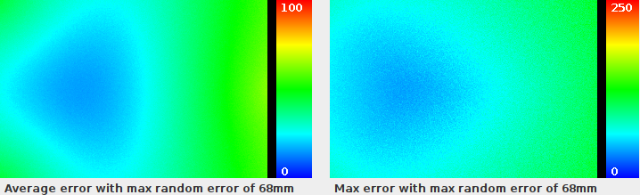

# Simulation
This contains some algorithm implementation of Time Of Arrival (TOA) and Time Difference Of Arrival (TDOA) case.
Choosing TOA algorithm would be in case we have access to the 3 distances between each fixed beacon and emitter.
Choosing TDOA algorithm would be in case we only have access to distance difference between 1st and 2nd receiver and 1st
and 3rd receiver, which is the case in that project.

Purpose of this project is to test algorithm result error if we add a small distance error in measurements. We iterate
every table position several times, compute real distances between beacons, add a random error on each distance, compute
algorithm from those errored measurement and compare result with real position.

## Simulated algorithms
### TDOA Fang
Paper explaining it: 
[http://xml.jips-k.org/full-text/view?doi=10.3745/JIPS.04.0172](http://xml.jips-k.org/full-text/view?doi=10.3745/JIPS.04.0172)

Implemented in
[SimuMultilateration/src/com/opensabot/multilateration/tdoa/FangThreePointsLateration.java](SimuMultilateration/src/com/opensabot/multilateration/tdoa/FangThreePointsLateration.java)

### TDOA Iterative three points
Kind of brute force not working solution, you can ignore it.

Implemented in
[SimuMultilateration/src/com/opensabot/multilateration/tdoa/IterativeThreePointsLateration.java](SimuMultilateration/src/com/opensabot/multilateration/tdoa/IterativeThreePointsLateration.java)

### TOA Circle three points
Principle: draw circles around each fixed receiver of radius of measured value, find intersection of the three circules.

Implemented in
[SimuMultilateration/src/com/opensabot/multilateration/toa/CircleThreePointsToaLateration.java](SimuMultilateration/src/com/opensabot/multilateration/toa/CircleThreePointsToaLateration.java)

### TOA TULIP three points
Principle: https://confluence.slac.stanford.edu/display/IEPM/TULIP+Algorithm+Alternative+Trilateration+Method

Implemented in
[SimuMultilateration/src/com/opensabot/multilateration/toa/TulipThreePointsToaLateration.java](SimuMultilateration/src/com/opensabot/multilateration/toa/TulipThreePointsToaLateration.java)


# Run project
Project contains several entry points for different tests. We will focus on `com.opensabot.multilateration.ImageSimu`
which generate a graph of average error of algorithm.

## Configure project
In `com.opensabot.multilateration.ImageSimu` you can update constants:
* `NB_ITERATION = 100` is the number of iteration to run algorithm for each position.
* `ERROR = 68` is the maximum of random error to be added on measurements. 68mm correspond to the distance ran by 5 
  25kHz ultrasonic pulses (340 * 1/25000 * 5 = 0.068m), which feels achievable objective for the hardware.
* `ERROR_THRESHOLD_AVG = 100` is the max value of scale displayed at right of generated image for average error graph.
* `ERROR_THRESHOLD_MAX = 250` is the max value of scale displayed at right of generated image for max error graph.

You can also comment algorithm you don't want to run and chose one and only to run in this block of code
```java
		// Run wanted algorithm
		// TOA algorithms
//		runToa1CircleThreePointsToaLateration(b1, b2, b3, errorMap);
//		runToa2CircleThreePointsToaLateration(b1, b2, b3, b12, b22, b32, errorMap);
//		runToa1TulipThreePointsToaLateration(b1, b2, b3, errorMap);
//		runToa2TulipThreePointsToaLateration(b1, b2, b3, b12, b22, b32, errorMap);
		// TDOA algorithms
		runTdoa1FangThreePointsLateration(b1, b2, b3, errorMap);
//		runTdoa2FangThreePointsLateration(b1, b2, b3, b12, b22, b32, errorMap);
//		runTdoa1IterativeThreePointsLateration(b1, b2, b3, errorMap);
```

Some configuration run only one measurement compute with one set of fixed beacons, and other run it with two sets of
fixed beacons and get average of two measurements.

## Run simulation
Either open and run project with and IDE and ensure working directory is set to `simu/SimuMultilateration`.

Or open a console and go to SimuMultilateration project, and compile it.
```bash
cd simu/SimuMultilateration
javac src/**/*.java -d target/
```

Run viewer
```bash
java -cp target/ com.opensabot.multilateration.ImageSimu
```

# Results
All simulations were ran with a random error between 0 to 68mm added in values that hardware will measure, 500
iterations.

68mm error correspond to an error of 5 ultrasonic pulses at 25kHz.

## TDOA
### Fang algorithm
With one set of 3 fixed receiving beacon:



With one 2 sets of 3 fixed receiving beacon, final point is average of 2 found positions:



## TOA
### Circle algorithm
With one set of 3 fixed receiving beacon:



With one 2 sets of 3 fixed receiving beacon, final point is average of 2 found positions:



### TULIP algorithm
With one set of 3 fixed receiving beacon:



With one 2 sets of 3 fixed receiving beacon, final point is average of 2 found positions:



## Conclusion
As we can see, choosing a TDAO algorithm instead of TOA will not make system less tolerant to errors in measurement, but
should be easier to implement. Adding multiple receivers even if very closed from each other should also improve system
accuracy. With not really accurate measurement, with an error of 68mm on measured values, worst found position has
almost alway an error of less than 12cm, and even less than 10cm in most cases.